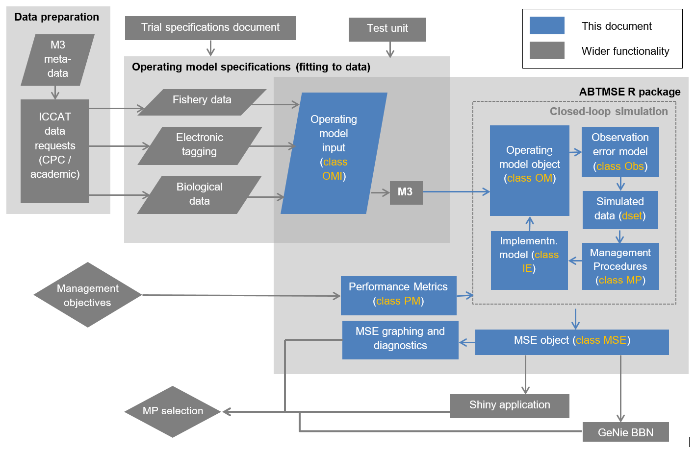

<style type="text/css">

body{ /* Normal  */
   font-size: 12px;
}
td {  /* Table  */
   font-size: 8px;
}
h1 { /* Header 1 */
 font-size: 18px;
 color: DarkBlue;
}
h2 { /* Header 2 */
 font-size: 15px;
 color: DarkBlue;
}
h3 { /* Header 3 */
 font-size: 14px;
 color: DarkBlue;
}
code.r{ /* Code block */
  font-size: 10px;
}
pre { /* Code block */
  font-size: 10px
}
</style>


```{r set options, echo = FALSE}
knitr::opts_chunk$set(collapse = TRUE, comment = "#>")
knitr::opts_chunk$set(dpi=85)
options(width = 650)
```

<br>

# Foreword

The Atlantic Bluefin Tuna Management Strategy Evaluation is funded by the ICCAT GBYP (coordinated by Antonio DiNatale <antonio.dinatale@iccat.int>). The technical aspects of this modelling work are overseen by the GBYP Core Modelling Group: David Die, Clay Porch, Laurie Kell, Antonio Di Natale, Doug Butterworth, Harritz Arrizabalaga, Yukio Takeuchi, Sylvain Bonhommeau, Toshi Kitakado, Miguel Santos, Paul de Bruyn, Polina Levontin and Richard Hillary. Previous collaborators include Joe Powers and Campbell Davies. 

This research benefits from the contributions of a large number of scientists from ICCAT contracting parties and public institutions.  

This R package and documentation were produced by Tom Carruthers (technical assistant) under the provision of the ICCAT Atlantic Wide Research Programme for Bluefin Tuna (GBYP), funded by the European Union, several ICCAT CPCs, the ICCAT Secretariat and by other entities (see: http://www.iccat.int/GBYP/en/Budget.htm). The contents of this document do not necessarily reflect the point of view of ICCAT or other funders and in no way anticipates future ICCAT policy in this area.

<br>

# Objective of this document

This document is intended to guide a prospective ABT-MSE user through an MSE process for Atlantic bluefin tuna providing examples on how to:

* specify custom performance metrics
* develop their own operating models
* design and test management procedures 
* produce their own plots and diagnostics

This guide also provides a reproducible account of how the reference set of operating models were developed from data. 

<br>

# Version Notes

The package is subject to ongoing testing. If you find a bug or a problem please send a report to <t.carruthers@oceans.ubc.ca> so that it can be fixed!  

## New Additions to this Version (v2.1)

* Operating models are conditioned using stock reduction analysis before 1960 after which the model follows a statistical catch-at-length formulation.

* Operating models are now fitted to CPUE indices that are used in Eastern and Western bluefin tuna stock assessments.

* All 18 operating models of the reference set are available in the package.

* New performance summary table (getperf) and plotting functions (plot, Tplot) that match the Trial Specifications document. 

* Customization future recruitment scenarios, fleet allocation scenarios and spatial stock definitions.


## Coming soon 

MSE diagnostics

* Convergence plots
* Value of information

Visualization

* Pencil plots (likelihood of obtaining biomass reference levels)
* Shiny App v2.0
* R markdown standardized MSE report
* Updated Genie Bayesian belief network (for evaluation of utility functions)

Management procedures

* VPA stock assessment MPs (to represent the status quo assessments)
* State-space data-rich stock assessment MPs (for comparison)

Optimizations

* Faster historical F calculation using Rcpp
* Additional use of parallel processing
* General speed increases (additional memory preallocation, vectorization etc)

Operational modelling

* Finalized reference OMs
* Robustness OMs
* More complex observation error models
* More complex implementation error models

Package 

* More in depth documentation of data
* Standard plot and summary methods for OM, OMI and other object classes

<br>

# Introduction

## GBYP and Management Strategy Evaluation


The Atlantic-Wide Research Programme on Bluefin Tuna (GBYP) aims to develop a new scientific management framework by improving data collection, knowledge of key biological and ecological processes, assessment models and management. A critical component of the GBYP is the construction of a robust advice framework consistent with the precautionary approach (GBYP 2014). A Management Strategy Evaluation (MSE, Cochrane 1998, Butterworth 1999, Kell et al. 2014, Punt et al. 2014) approach has been proposed to address this goal (Anon. 2014b). MSE establishes operating models that represent credible hypotheses for population and fishery dynamics which are used to quantify the efficacy of various management procedures. These management procedures may encompass a wide range of complexity from conventional stock assessments linked to harvest control rules (Hilborn 2003) through to simple empirical management procedures that calculate catch limits directly from resource monitoring data indices (Geromont and Butterworth 2014a;b, Kell et al. 2015).

MSE applications generally develop operating models from stock assessments that are fitted to data in order to ensure that model assumptions and estimated parameters are empirically credible (Punt et al. 2014, e.g. CCSBT 2011). In the case of Atlantic bluefin tuna, such a model requires enough complexity to capture the core uncertainties regarding Atlantic bluefin tuna dynamics (Fromentin et al. 2014, Leach et al. 2014). These include stock structure (Kell et al. 2012), stock mixing, migration (Fromentin and Lopuszanski 2014) and biases in observed data (e.g. annual catch data). Additionally the model should be able to accommodate the wide range of data that have been collected for Atlantic bluefin tuna including catch rate indices (Abid et al. 2015, Hanke et al. 2015, Kimoto et al. 2015, Lauretta and Brown 2015, Santiago et al. 2015, and Walter 2015), aerial surveys (Bonhommeau et al. 2010), length composition data, larval surveys (Ingram et al. 2015), electronic tagging data (Block et al. 2005) and stock of origin data (Rooker et al. 2014). 

## The operating model 

A spatial, multi-stock statistical catch-at-length assessment model was developed as a basis for defining operating models for Atlantic bluefin tuna. The modifiable multi-stock model *M3* (Carruthers et al. ) aims to improve upon previous multi-stock models such as MAST (Taylor et al. 2011) in three core areas. The first iteration of the model: (1) makes use of indices of abundance specific to time-area strata (e.g. for a given ocean area and month of the year), (2) does not use conventional tagging data to inform exploitation rates, (3) is fitted to samples of length composition data and therefore avoids established problems related to ageing individuals based on a growth curve and length data only.

The current operating model assumes a 10-area spatial structure:

```{r loadsecret,echo=F,warning=F,error=F,message=F}
library(ABTMSE)
loadABT(quiet=T)

```

```{r plotareas,echo=F,message=F,warning=F,error=F,fig.width=3, fig.height=2.5}
par(mar=rep(0.01,4))
areaplot(MSE_example)
```

The model is disaggregated into subyear time blocks that follow quarters (ie Jan-Mar, Apr-Jun, Jul-Sept, Oct-Dec). This is primarily a constraint arising from how data have been reported historically.  

## MSE design

The Atlantic bluefin tuna MSE follows an overarching design document coordinated by Doug Butterworth [Trial Specifications](https://github.com/ICCAT/abft-mse/tree/master/Manuals_and_design_documents/Trial_Specifications.docx) which details the reference and robustness scenarios for the MSE, the equations of the operating model and a set of preliminary performance metrics. 

## Data 

All of the data that are used in the operational modelling are available [here](https://github.com/ICCAT/abft-mse/tree/master/data/) or [here](https://drive.google.com/open?id=13pFaM3BTnzQ1BNQGoYn4O2n1IeD18V3VTbN9Hv7139U)

A meta-data summary of all data available to the ABT-MSE project is available online [here](https://docs.google.com/spreadsheets/d/ 13pFaM3BTnzQ1BNQGoYn4O2n1IeD18V3VTbN9Hv7139U/edit)

A description of the various types of data and their role in operational modelling can be found [here](http://www.iccat.int/Documents/CVSP/CV072_2016/n_7/CV07201796.pdf)

## The ABT-MSE process




<br>

## The ABT-MSE file structure

The ABT-MSE folder contains all of the data, models and help documentation required for running Atlantic bluefin MSE analyses. The file structure has three major components: 

* data for informing operating models, 
* scripts for building operating models and 
* an R package for doing MSE analysis. 

The full file structure looks like this: 

```
//ABT-MSE                    

  /Data                         All data used in conditioning operating models or simulating future indices are included here
  
    /Previous assessments         Results from previous stock assessments for use in comparing OM results
    /Processed                    Data that are filtered or processed for use
 
      /Area definitions             The various oceanareas and their names
      /Conditioning                 These are the various data in the correct format for input into the M3 OM
      /CPUE indices                 A compilation of the standardized / nominal CPUE indices (courtesy of A.Kimoto)
      /MP indices                   A compilation of indices that may be simulated in the future for use by MPs
    
    /Raw                          Data without filtering or processing to meet OM specifications     
  
      /Aging                        Data for deriving growth curves
      /CAS                          Catch at Size data
      /Catch                        Nominal total removals
      /Fleet structure              Fleet definition guides
      /Misc                         Some old tagging data
      /PSAT                         Electronic tagging data
      /SOO                          Stock of origin data (courtesy of D. Secor et al. )
      /SSB                          Larval indices (hypothesized to be indicative of SSB)
      /Task1                        ICCAT Task I catch and effort data
      /Task2                        ICCAT Task II catch and effort data (finer scale)
      
  /docs                         Documents for constructing the ABTMSE webpage
  
  /Genie                        Bayesian belief network summary of MSE outputs

  /M3                           OM model directory containing .tpl etc

  /Manuals and design documents   Reference guides and help documentation      

  /Objects                      MSE R objects

    /Observation models           Various scenarios for how well data can be observed for use in MPs
    /OMs                          The various operating models including data inputs, ADMB outputs, derived OM objects
    /Recruitment scenarios        R list objects containing possible recruitment scenarios
   
  /R package                    Related to the ABTMSE R package

    /ABTMSE                       The package folder
    
      /data                         Data and R object for use in MSE analysis
      /inst                         Other data and document generation .Rmd files
      /man                          Package Documentation
      /R                            Source code
      /vignettes                    Code for building help documents (like this one)
   
  /Reports                      Project reporting

  /Results                      Raw results data and analysis

  /Genie                        Data supporting the Bayesian belief network

  /RScripts                     R code for building operating models, observation models and debugging

    /Data processing              A series of scripts for processing the various data for operating model fitting
    /Debugging                    Developer scripts
    /Observation_models           Where observation class 'Obs' objects are built
    /Operating_models             Where operating model class 'OM' objects are built
    /Packaging                    Code for building the R package
    /Simulation                   Code for sim-testing the M3 operating model
   
  /Shiny                        A shiny app for communicating MSE results

  /Simulated data               Data for use in developing MPs or collaborating with other scientists

  /Source                       The old source code for the ABT-MSE R framework

  /Submissions                  ABT-MSE related publications
```

<br>

## Software Design

### Aims and Objectives

The ABT-MSE software was designed to be: (1) open-source with straightforward distribution and installation; (2) well documented with an intuitive system for accessing documentation; (3) as concise as possible; (4) easy to use, yet hard to misuse; (5) extensible, allowing for users to specify operating models and easily develop and test new MPs; and (6) sufficiently flexible in design to respond to feedback from stakeholders or member of the GBYP core modelling group. These objectives determined the environment, programming language and programming paradigm, all of which are described in more detail below. 

### Open Source

ABT-MSE freely available online from a dedicated GitHub code repository (www.github.com/iccat/abft-mse) which contains all data, code and documentation. The GitHub repository allows users to request software features, report bugs, and track software updates. GitHub also supports continuous integration of code from multiple developers and feature ‘branching’ a form of version control where additions can be coded in parallel and merged with the master branch. The principal challenge of developing MSE for bluefin was  adopting a language and a programming paradigm that was sufficiently flexible to allow for increasingly complex additions. 

### Environment, Programming Language and Software Dependencies

ABT-MSE was developed in the statistical environment R (R Core Team 2017) and is primarily coded in the R language. There are important reasons for using R in this context. It is arguably the most widely used and most flexible software for scientific and statistical analysis, and is commonly applied in quantitative fisheries science for the processing and analysis of data. R has proven popular with the scientific community due to a large and diverse range of freely available packages and the ability to produce well-designed publication-quality figures. It follows that R provides an ideal environment for specifying operating models and then interpreting MSE outputs.

R allows for the development of self-contained packages which offers the attractive possibility of distributing complex software in a single file. Installation of ABT-MSE is achieved in a single command from the R console. R packages provide users with a certain degree of confidence since they must meet CRAN policy (CRAN 2017), which includes error checking, installation size limits, compatibility among operating systems and documentation requirements. ABT-MSE makes use of integrated R help and includes detailed documentation including worked examples for all objects and functions. The ABT_MSE manuals and training materials are automatically rebuilt from the latest software release using R markdown (Allaire et al. 2017). 

A principal limitation of computing in R is that calculations can be slow compared with languages such as C++, Python and Java. This is particularly important in this context because MSE has relatively high computational requirements. To address this, ABT-MSE defaults to parallel processing using the package ‘parallel’ (R Core Team 2017) to distribute calculations over either multiple cores of a workstation or a larger cluster of many hundreds of virtual machines – ABT-MSE is compatible with online computing resources such as Amazon Web Services (2017) and Google Cloud (2017). 

### Programming Paradigm and Design

An important feature of R is that it supports Object-Oriented Programming (OOP) (Jacobsen et al. 1992) in which data, models and results are organized in standardized objects (classes) on which standardized functions (methods) may be applied. In general OOP is desirable because it allows for the reuse of code, can impose stricter requirements of object attributes (e.g. annual catches must be a vector of non-negative real numbers), it demands careful software planning from the outset and is generally more extensible and easy to maintain that non-OOP code. ABT-MSE adopts the OOP paradigm to standardize the formatting of data and support rapid building of operating models. For example, evaluating the robustness of management procedures across a range of operating models (OM). 


<br>

# Installation

1. Install [R for Windows](https://cran.r-project.org/bin/windows/)
2. Install [RStudio](https://www.rstudio.com/products/rstudio/download/)
3. Download the ABT-MSE file structure from [here](https://github.com/ICCAT/abft-mse)
4. Install the ABTMSE R package by opening RStudio and entering the following code at the R console (making sure to change the file path to reflect where you put the ABT-MSE folder on your computer):
```{r install_package,eval=F}
install.packages("C:/ABT-MSE/R_package/ABTMSE_2.1.0.tar.gz") 
```
5. Check that the installation is successful by finding this help file (the ABTMSE vignette):
```{r load_library, eval=F}
library(ABTMSE)
??ABTMSE
```

If you have any difficulties please send an inquiry including some reproducible code to: t.carruthers@oceans.ubc.ca

<br>

# Quick start: run an MSE with pre-specified objects

## Loading the library
```{r loadlibrary}
library(ABTMSE)
```

## Set a random seed
In order to make results presented here reproducible, we set a random seed for this R session. 
```{r seed}
set.seed(1) 
```

## Loading the objects required by the MSE analysis
This function loads all objects that are used by the MSE analysis including Operating Model Input objects (class *OMI*),
Operating Model objects (class *OM*), Observation error models (class *Obs*), allocation schemes and recruitment scenarios.

```{r loaddata}
loadABT()
```

If you would like to see what objects have been loaded you can find them using the generic class finder 'avail':

```{r avail}
avail('OMI')
avail('OM')
avail('Obs')
```

## A guide to the MSE design
An MSE design object *Design* was also loaded with loadABT(). *Design* is a list of the factors and their levels used in defining the reference set of operating models. This replicates the MSE design outlined in the [Trial Specifications document](https://github.com/ICCAT/abft-mse/tree/master/Manuals_and_design_documents/Trial_Specifications.docx) .

The list item *all_levs* shows all levels that were used in defining the factorial design of the MSE reference operating models:

```{r design_all_levse}
Design$all_levs
```

A text description of these is also available:

```{r design_all_lnams}
Design$all_lnams
```

The full design matrix can be found in the list item *Design_Ref* and is just the factorial combination of these levels:

```{r design_design_ref}
Design$Design_Ref
```

This design grid explains the nomenclature of the various operating models (class OM) and their input definition files (class OMI) which are numbered from 1 to 18 corresponding with the rows of this design matrix:

```{r design_list_OMs}
avail('OM')
```

You'll notice that some objects in the ABTMSE package have the extension *\_example*. These are stream-lined objects that are suitable for tutorials and demonstrations which involve less computational overhead (e.g. they require fewer simulations).


## Running an MSE using pre-specified objects

### Observation models

Observation models simulate data subject to bias, imprecision and other statisical properties such as temporal autocorrelation. 

There are `r length(avail('Obs'))` prespecified observation error models (class Obs) currently available, lets inspect one:

```{r qs_avail_obs}
avail('Obs')
Bad_Obs
```

As you can see the observation error model is quite lengthy, and in particular the slot *MPind*.

These are real abundance indices proposed for use by management procedures (the raw data are available [here](https://github.com/ICCAT/abft-mse/tree/master/Data/Processed/MP%20Indices)). These real indices are compared with operating model predictions to characterize their statistical properties so that realistic data can be generated in future projections. 

In the *Bad\_Obs* model there are currently `r max(Bad_Obs@MPind$No,na.rm=T)` indices. Note that many MPs that use indices to set TACs, will operate on one of these specific indices. For example you could have a delay difference model using index 1, (*DD\_1*) and another using index 2 (*DD\_2*).

If you require further information, all of the objects loaded by ABTMSE package are documented. These help files can be accessed with the question mark operator. Some of the loaded objects are dedicated classes that have additional, more detailed documentation: 

```{r qs_help_obs}
?Bad_Obs
class(Bad_Obs)
class?Obs
```

### Implementation Error models

There are `r length(avail('IE'))` prespecified implementation error models (class IE) currently available, lets look up help documentation for one of these:

```{r qs_avail_IE}
avail('IE')
?Umax_90
```

Implementation error models determine how well TAC recommendations will be followed in practice and can include error, overages, underages and maximum harvest rates (ie a TAC can be taken up to a maximum harvest rate of 90 per cent).

### Management procedures

Specifying management procedures is somewhat more complex in a multistock MSE as they can be specific to data from certain areas. For example *DD_MED* may be a delay-difference assessment fitted to a relative abundance index for spawning biomass in the Mediterranean (e.g. a larval survey). 

To specify management procedures in this MSE framework you must select a MP for each spatially distinct area to which an MP is to be applied. For example, a VPA stock assessment in the West and a Surplus production stock assessment in the East. Traditionally the spatial division for Atlantic bluefin has been at 45 degrees W. In this quick start section we're going to ignore MP areas and the package will assume the default setup which is 2 data - 2 MP processes divided by the 45deg W.  

A related issue is fleet allocation of the TACs that are calculated by region. Again we're going to leave allocation for a later section of this document as it is quite complex. The default will be used here which allocates regional TAC (e.g. West/East) in proportion to the fraction of catch by each fleet in that region over the last three years (2012-2014). 

As with the observation and implementation error models you can search for management procedures and find help documentation on these:

```{r qs_MPs}
avail('MP')
?UMSY
```

Later we will design and test our own management procedures ([MSE Step 4](#step4)). For now we're going to select a few premade MPs for a demonstration MSE. 

As mentioned above, MPs must be chosen in groups, one corresponding to each area for which data are disaggregated. In the default MSE run there are two per management system (an MP in the East and an MP in the West). We're going to use a list object to store our pairs of MPs:


```{r qs_spec_MPs}
myMPs<-list(c('UMSY','UMSY'),
          c('DD_i4','DD_i2'),
          c('MeanC','MeanC'))

```

This code will test three management systems. One where UMSY is used in both the West and the East, a second where a delay-difference model is applied in the West and the East and a third management system where the TAC is set to mean historical catches in both the West and the East. The principal motivation for choosing these MPs in this tutorial is that they run quickly. 

### Operating models

A search for operating models reveals `r length(avail('OM'))-1` reference OMs and 1 example:

```{r qs_OM_help}
avail('OM')
class?OM
```

Operating models are generated from a three step process:

1. Define operating model inputs (class OMI)
2. Run M3 ADMB operating model to fit to data
3. Read in M3 model outputs into an operating model class object (class OM) 

When OM class objects are made, a number of expensive and lengthy calculations are carried out up front. For example MSY reference points and historical effort scenarios are calculated so that these don't have to be run each and every time an MSE is run, and also to ensure that MSE results are reproducible.

Later in this document we'll cover exactly how data are formatted for operating models and how these are fitted to data. For now we're going to use one of the prebuilt OMs *OM\_example* that only requires the computation of `r OM_example@nsim` simulations.

### Running an preliminary MSE

Management strategy evaluation is computationally intensive and typically requires the recursive application of statistical models (MPs) for many independent simulations. 

It is a computational problem that is 'embarrasingly parallel' and therefore can make use of the extra horsepower of a modern PC which has multiple threads (typically 4 threads for an i5 Intel CPU and 8 threads for a hyperthreaded i7, although it is not uncommon for contemporary workstations to have 32 or more threads).

To use parallel processing we need to initialize a cluster on your computer:

```{r sfinit}
sfInit(parallel=TRUE, cpus=detectCores()) 

```

To run an MSE it is necessary to specify the:

* operating model, 
* observation error model, 
* MPs to be tested,
* implementation error model and 
* the interval over which MPs will re-run (how often new TAC advice is calculated). 

In this preliminary run we select the example operating model *OM\_example*, the bad observation error model *Bad_Obs*, our custom MPs above, an update interval of 3 years (ie MPrun1 TAC1, TAC1, TAC1, MPrun2 TAC2, TAC2, TAC2, MPrun3... etc) and an implementation error model that includes 10% overages.

*Note that this will take a few minutes to run*

```{r qs_MSE, eval=F}
MSE_example<-new('MSE',OM=OM_example,Obs=Bad_Obs,MPs=myMPs,interval=3,IE="Overage_10")
```

You may have noticed that while we specified only three management systems (three pairs of East/West MPs) in fact, four were tested and that the first, labelled *ZeroC (East) and ZeroC (West)* we did not specify. 

ZeroC is a reference management procedure that recommends close to zero catches (enough to generate CPUE data but essentially none). 

The purpose of the *ZeroC* MP is to generate performance metrics that evaluate future stock size in reference to the highest simulated biomass achievable. In its current configuration the MSE function will always test this *ZeroC* MP alongside any that you specify. 

### MSE outputs

A very large amount of information has been stored in the MSE object *MSE_example*. There are many ways to analyse these simulation data. 

In a later section we will return to this issue and specify custom performance metrics that interrogate MSE objects ([MSE Step2](#step2). For now lets take a look at the standard reporting options available in the current ABTMSE package.

A standard performance metrics table can be calculated using the function getperf():

```{r qs_getperf}
getperf(MSE_example)
```

Two tables are produced in a list object, one table for each stock. 

The tables show performance by MP (row) and performance metric (column). Each of these performance metrics is a class PM and has help documentation available to describe it:

```{r qs_help_PMs}
avail('PM')
?C10
?PGK
```

Projection plots can also be produced:

```{r qs_plot_MSE, fig.width=7, fig.height=4.5}
plot(MSE_example)
```

Each row of this plot represents an MP. Projections of catch and SSB are shown in terms of their median (solid black line), 5th and 95th percentiles (the shaded region) and ten individual simulations (the multicolored lines). 

Note that among MPs, each simulation has identical future biological conditions (recruitment, growth etc). In order words a red projected line (a simulation) for one MP corresponds with the red projected line for the other MPs. By keeping background simulation conditions the same among MP runs, the relative performance of MPs is revealed in much fewer simulations (one MP cannot outperform another due to sampling a more productive future by chance). 

A principal objective of MSE is to reveal the trade-offs among management objectives. The package includes a standard trade-off plot:

<a id="QS_Tplot"></a>

```{r qs_Tplot_MSE, fig.width=9, fig.height=7}
Tplot(MSE_example)
```

Six performance metrics are plotted:

1. Long Term Yield (mean yield over the final 21-30 projected years)
2. Probability of being in the Green Kobe region ('F<FMSY' and 'B>BMSY') over the entire projection.
3. Probability of being in an overfished state (B<BMSY) over the entire projection
4. Probability of overfishing (F>FMSY) over the entire projection
5. Average Annual Variability in Yield (AAVY) the mean fractional difference in catches among years.
6. Final depletion, the mean spawning stock biomass relative to unfished in the final 21-30 projected years. 

In the first row, the six metrics are plotted against each other in three panels for the eastern stock. The second row repeats this for the western stock. 

Rows 3 and 4 show the tradeoff among East and West stocks for each metric. 

We'll revisit custom PMs in the [quantification of management objectives](#step2) step below. 
 
<br>

# Seven steps of MSE in the context of ABT

Punt and Donovan (2007) describe a conceptual framework for MSE that has 7 parts: 

1. qualitative specification and prioritization of the management objectives, as derived from legislation, legal decisions, and international standards and agreements;

2. quantification of the qualitative management objectives in the form of performance measures;

3. development and parameterization of a set of "operating models" that represent different plausible alternatives to the dynamics of the "true" resource and fishery being managed; 

4. identification of candidate management procedures, including monitoring strategies;

5. simulation of the future use of each candidate management procedure, involving for each time-step during the projection period: (a) generation of assessment data; (b) determination of the management action (i.e. assessment and application of some HCR); and (c) evaluation of the biological implications of the management action by removing the catch from the population as represented in the operating model;

6. summary of the performance of the candidate management procedures in terms of values for the performance measures; and

7. selection of the management procedure that best meets the specified objectives.

Here we use this framework to demonstrate the functionality of the current ABTMSE package. 

<a id="step1"></a>

## Step 1: Prioritization of management objectives

Although it may be desirable to quantify management objectives in the intial phase of MSE (Punt et al. 2015). In the context of Atlantic bluefin tuna this is less appropriate since MSE is relatively new in this setting and requires iterative engagement from managers and stakeholders to shape the analysis and interpret outputs (ie. Nakatsuka 2016). 

While prioritization of management objectives has not yet been established in this early phase of the ABT MSE, a number of tentative performance metrics have been outlined in the [Trial Specifications document](https://github.com/ICCAT/abft-mse/tree/master/Manuals_and_design_documents/Trial_Specifications.docx)

<a id="step2"></a>

## Step 2: Quantification of management objectives

Following the [Trial Specifications document](https://github.com/ICCAT/abft-mse/tree/master/Manuals_and_design_documents/Trial_Specifications.docx) there are currently `r length(avail('PM'))-1` performance metrics that are used to evaluate management procedures. These are functions of class 'PM' (performance metric) and can be listed using the *avail()* function. 

```{r Step_2_list_MPs}
avail('PM')
?POF
```

A performance metric function has particular attributes. Functions of class PM accept an object of class MSE (argument *MSE*) and an integer value (argument *pp*) representing the number of a stock in the MSE object. The PM function returns a matrix that has a row for each MP in the model and a column for every simulation. 

For example, the probability of overfishing metric *POF* calculated for the `r MSE_example@nMPs` MPs and `r MSE_example@nsim` simulations for stock *1* of the example MSE object *MSE_example*: 

```{r qs_PMs}
round(POF(MSE=MSE_example,pp=1),0)
```

This convention allows statistics to be generated for any metric. The Tplot function of the [quick-start section](#QS_Tplot) just plotted point values that were the mean values of the MPs. Lets calculate some other quantities for long term yield (*C30*) and Final depletion (*D30*) and plot the simulation by simulation tradeoff in median (percentile = 0.5,second column) estimates of Yield and Depletion:

```{r qs_PMs_det, fig.width=3, fig.height=3.5}
C30arr<-C30(MSE_example)
D30arr<-D30(MSE_example)
apply(C30arr,1,quantile,c(0.025,0.5,0.975)) # median and percentiles by MP (column)
plot(C30arr[2,],D30arr[2,],xlab="Median yield",ylab="Median depletion",col="#0000ff95",pch=19) # plot of individual simulations
```

Lets take a closer look at the probability of overfishing (*POF*) function. 

```{r Step_2_examine_POF}
POF
```

The POF function isn't particularly complex but you need to know a little about how data are stored in an MSE object to start specifying your own PMs. 

You can learn more about MSE objects using the built-in help documentation or by examining an example MSE object:

```{r Step_2_examine_MSE_class, eval=F}
class?MSE
slotNames(MSE_example)
dim(MSE_example@C)
```

In the case of the *POF* function three slots of an MSE object are used.

  MSE@F_FMSY is the slot containing fishing rate relative to FMSY 

  MSE@nyears represents the last year of the historical simulation.

  MSE@proyears represents the last year of the projection (the years where MPs are applied in closed loop simulation). 

The POF function extracts F/FMSY data for the projection time period, calculates how often it exceeds 1 (where overfishing is defined as F greater than FMSY) and then converts this into a percentage.

The *apply* function calculates the frequency of overfishing events in dimensions 1 and 2 of the \*MSE@FMSY\* array which correspond to MP and simulation number. This returns a matrix of percentages (interpreted here as probabilities) MP rows by nsim columns. 

Other PMs are quite similar. Here is *C10* (mean yield over the first 10 years of a projection):


```{r Step_2_examine_C10}
?C10
C10
```

*C10* is only concerned with averaging catches which are stored in the slot \*MSE@C\*. Again the apply() function is used to calculate mean catches by MP and simulation. 

Once you are familiar with the MSE object class it is straighforward to design your own PMs and make these compatible with the ABTMSE package.

Here we will design a metric that applies a 20% discount rate to catches in the projections. When doing this yourself you might find it helpful to create an MSE object and population index with the right names (*MSE* and *pp*) so that you can test the function as it is written:


```{r Step_2_create Y_DR_20}

MSE<-MSE_example     # Use the example MSE object loaded with loadABT()
pp<-2                # Specify a stock number in this case the West

Y_DR_20<-function(MSE, pp){
  DC<-0.8^(1:MSE@proyears)
  apply(MSE@C[,,pp,MSE@nyears+1:MSE@proyears]*rep(DC,each=MSE@nsim*MSE@nMPs),1:2,mean)
}    
class(Y_DR_20)<-'PM'  
```

Alternatively you might want to rank MPs according to a user defined utility function. Here we invent one for demonstration purposes that is the product of mean catch and mean spawning biomass at the end (last 5 years) of the projection:

```{r Step_2_create U1}

U1<-function(MSE, pp){
  yearindex<-MSE@nyears+(MSE@proyears-4):MSE@proyears
  Y<-apply(MSE@C[,,pp,yearindex],1:2,mean)
  SSB<-apply(MSE@SSB[,,pp,yearindex],1:2,mean)
  SSB*Y
}    
class(U1)<-'PM'  
```

So why bother with a standard class for performance metrics? The value of a generic PM class lies in standardized reporting. Here we use a pre-made generic trade-off plot *tradeoff* based on our newly defined performance metrics:

```{r Step_2_custom_reporting,fig.width=5, fig.height=5}

tradeoff(MSE_example,PMs=list(Y_DR_20=Y_DR_20,U1=U1))

```

The top row of panels in *tradeoff* are mean values, the bottom row shows individual simulations in a scatter plot. 

<a id="step3"></a>

## Step 3: Establishing operating models

### The OMI class object

The estimation 'engine' behind the ABTMSE R framework is M3, a multi-stock population dynamics model written in ADMB. Your ABT-MSE folder contains a subfolder "Manuals\_and\_design_documents" that contains further information about M3 including model equations and software design documents (they can be found online [here](https://github.com/ICCAT/abft-mse/tree/master/Manuals_and_design_documents)). 

The M3 model is essentially a multistock assessment model fitted to data to generate credible operating model scenarios for ABT population and fishery dynamics. The M3 model requires fishery, tagging and biological data formatted in specific way (for example catches in a table where each row is a catch record and the columns represent years, subyears, areas and fleets).

To make it easier for other users to modify the operating model data and assumptions, a new class of data object was designed. Named *OMI* (for Operating Model Input), this object class contains all the data in the correct format for input to the M3 model. This organisation of data allows for simple and rapid changes to OMI class objects and m3 model fitting, with the minimum of code. 

Package documentation covers the various slots of the *OMI* class:

```{r Step_3_OMI_class}

class?OMI

```

Additionally, the *OMI* objects of the various operating models and example *OMI* objects were loaded with the function *loadABT()* so it is straightforward to examine these and look at the format of real data:

```{r Step_3_OMI_class_interrogation}
avail('OMI')
OMI_1@Hyears      # Historical years used in SRA model
dim(OMI_1@mat)    # Maturity array [OMI@np x OMI@na x OMI@ny]
head(OMI_1@Cobs)  # Catch data table
```


### Modifying an existing OMI object and running M3

Lets make a change to the maturity schedule of the two stocks to demonstrate how a new operating model could be run. The OMI object we're going to look at is *OMI\_6*. 

The MSE design object (looking at Design\$Design\_Ref and Design\$all\_lnams) shows that operating model 6 is specified at the third level of the first factor (future recruitment = 3), the second level of the second factor (SSB level = B) and the first level of the third factor (maturity-mortality = I):

```{r Step_3_OMI_6_interrogation}

Design$Design_Ref[6,]
Design$all_lnams[[1]][3]
Design$all_lnams[[2]][2]
Design$all_lnams[[3]][1]
```

We want to change the maturity schedule which is an array in the *OMI* object with the dimensions stock x age x year:

```{r Step_3_OMI_7_interrogation2}
dim(OMI_7@mat)
```

The current maturity schedules are time-invariant (the same among model years) and the same for both stocks:

```{r Step_3_OMI_7_old_mat,fig.width=4, fig.height=4}
matplot(t(OMI_7@mat[,,30]),col=c('blue','red'),type='l',ylab="Maturity",xlab="Age",main="Previous maturity, OMI_6")
legend('bottomright',legend=c("East","West"),text.col=c('blue','red'),bty='n')
```

In this example we're going to copy the *OMI\_7* object, and change maturity to a logistic model of selectivity with an age at 50% maturity (inflection point) of 7 in the East and 10 in the West, and slope of 1.5 for both stocks:


```{r Step_3_OMI_7_new_mat,fig.width=4, fig.height=4}
OMI<-OMI_7 # copy the object
OMI@Name<-"Logistic maturity 7/10"
OMI@mat[1,,]= 1/(1+exp(7-(1:OMI@na))/1.5)
OMI@mat[2,,]= 1/(1+exp(10-(1:OMI@na))/1.5)
matplot(t(OMI@mat[,,30]),col=c('blue','red'),type='l',ylab="Maturity",xlab="Age",main="New maturity, OMI")
legend('bottomright',legend=c("East","West"),text.col=c('blue','red'),bty='n')
```

Now that we have a new modified *OMI* object we need to write the M3 input file. For the purposes of this example we're just going to use the M3 model folder in your ABT-MSE directory. 

```{r Step_3_write_M3}
M3dir<-"C:/GitHub/abft-mse/M3"   # Or whereever you put the /ABT-MSE/ directory on your computer
M3write(OMI,M3dir)
```

The M3 model can now be run. 

*Note that this will take around 30 minutes - 2 hours depending on the speed of your computer.* 

*Running speed of the ADMB M3 model is dependent on the write speed of the computer drive where the M3 executable is stored - try to use a hybrid or a solid-state drive if possible.*

*If you want to stop the runM3() function, you'll have to open Windows Task Manager and stop the Rstudio R session app.*

```{r Step_3_run_M3,eval=F}
runM3(M3dir)

```

A standardized M3 fitting report (a pdf) can also be generated to evaluate fit to data. If you want this report to include the new name of your OMI object you need to save the OMI object in the same directory. 

```{r Step_3_make_M3_report,eval=F}
save(OMI,file=paste0(M3dir,"/OMI"))  # Let the report see any name changes
make_fit_reports(M3dir)              # Make a .pdf report

```

If you are planning on running this model again it may be beneficial to store the final parameter estimates as initial values so that the optimization starts reasonably close to the solution and therefore reaches convergence (runs) faster. To do this use the pin\_from\_par() function which creates a .pin file in your M3dir directory:

```{r Step_3_pinfrompar}

pin_from_par(M3dir)               # Record the MLE parameter estimates as initial values

```

Since running M3 models is fairly computationally intensive, it is often beneficial to fit multiple M3 models in parallel. To do this you need multiple folders (this is an MS Windows restriction unfortunately) each with an M3.exe and a stats.cxx file. You can copy these files from the ABT-MSE/M3/ directory.

For each of your operating model folders (that now have an M3.exe and stats.cxx file in them) you can use the M3write() function above to write an M3 data file based on unique OMI objects. Once each folder has an M3.exe, stats.cxx and M3.dat file you can run the M3 model.  


*Note: this can be done manually by navigating to the folder and running the executable which while clunky, means you don't have to wait for the runM3() function to finish before you can keep working in R*

There is a parallel version of *runM3()* called *runM3p()* that will operate on a  on a vector of character names that represent these folders, ie: 

```{r Step_3_run_M3_parallel,eval=F}
 M3dirs<-paste0("C:/myOMfolders/",1:8)          # An example, these folders don't really exist
 M3dirs
 sfInit(parallel=TRUE, cpus=detectCores()) 
 #sapply(1:length(M3dirs),runM3p,OMdir=M3dirs)  # Lets not actually do this!
 #make_fit_reports(M3dirs)                      # Or this!

```


### Converting M3 model outputs into an operating model object (class OM)

Once you have run M3 it is straightforward to make the fitted model compatible with the rest of the MSE framework so that you can test management procedures. To do this you create an operating model object of class *OM*:

```{r Step_3_make_OM,eval=F}
 OM_example<-new('OM',M3dir)

```

This has produced an operating model with the default settings, namely 32 simulations, future projection of 30 years, recruitment based on Beverton-Holt dynamics and default naming of stocks ("East" is stock 1, "West" is stock 2). 

The operating model object has read the M3 outputs and sampled model parameters from the estimated variance-covariance matrix (assuming a multivariate normal distribution). For each sample of parameters the historical fishery has been reconstructed and MSY reference points have been calculated. 

Once again there is package documentation for this class of object and examples were loaded by *loadABT()*.

```{r Step_3_interrogate_OM}
 avail('OM')
 class?OM
 OM_example@MSY
 OM_example@UMSY
 OM_example@Snames

```

The purpose of the OM object is to interpret M3 outputs and provide a reproducible starting point for MSE analysis. 

For example, I could create an OM object with 500 simulations and email this to another analyst and they would obtain precisely the same MSE results. This level of reproducibility is important because it removes chance from cross-comparison of MP performance (for a given OM an MP always performs the same). 

It is easy to specify an operating model with a greater number of simulations for a different projected time period if necessary by modifying the *nsim* and *proyears* arguments. Similarly the stocks can be renamed also using the *Snames* argument:

```{r Step_3_make_OM_custom_proyears_etc,eval=F}
 OM_example_2<-new('OM',M3dir,nsim=200,proyears=30,Snames=c("Med","GOM"))

```

### Modifying future recruitment scenarios

An important axis of uncertainty in this MSE is future recruitment. This is described in the [Trial Specifications document](https://github.com/ICCAT/abft-mse/tree/master/Manuals_and_design_documents/Trial_Specifications.docx) and the MSE *Design* object:

```{r Step_3_custom_recruitment_design}
Design$all_lnams[[1]]

```

In these scenarios, historical recruitment is being applied in varying ways in future projections. This is conceptually simple but technically a bit tricky. Take level three of this factor as an example:

```{r Step_3_custom_recruitment_design2}
Design$all_lnams[[1]][3]

```

In the West, we have a hockey stick stock-recruitment model fitted over all historical years and a Beverton Holt stock-recruitment model fitted over all historical years. For projections, these start by assuming the hockey stick recruitment dynamics and then change to the Beverton Holt model after 10 projected years. 

Things are more complex in the East. Projections start with Beverton Holt recruitment fitted to model predictions from 1983 onwards but with a fixed steepness of 0.98. After ten projected years this changes to the Beverton Holt stock recruitment model fitted to 1950-1982 recruitment/SSB estimates also with a fixed steepness of 0.98. 

To provide enough flexibility to define operating models in this way a list object named *Recruitment* was defined. An example of one of these *Recruitment* objects was loaded with *loadABT()* at the start of this session. This recruitment example matches level three which I have just described.

Lets have a look at this rather complex looking list:

```{r Step_3_example_recruitment}
Recruitment_example
names(Recruitment_example)
```

We're going to go through each list object one-by-one. 

The first list item is called *$proyears*. This defines when recruitment changes in the future. *proyears* is an array with n time period rows (in this case there are two proejcted time periods: projection years 1:11 and 12 onwards) and 2 columns showing when these projection time periods start and end. 

In this case we can see time period 1 (row 1) running from projection year 1 to projection year 11 and time period 2 (row 2) running from projection year 12 to infinity. 

The second list item is call *$years* and this defines what historical years of estimated recruitment and SSB are used to calculate the stock-recruitment relationships. This is a 3D array of dimension 2 x Stock x n time periods. The numbers in the array are all relative to the model starting year of 1960. For example:

```{r Step_3_example_recruitment_years}
Recruitment_example$years[,,1]
```

Column 1 specifies 1983 onwards (1983-1960 = 24) recruitment for the East, Column 2 specifies stock-recruitment estimation for all historical years.

```{r Step_3_example_recruitment_years2}
Recruitment_example$years[,,2]
```

Shows the historical temporal range of the model recruitment/SSB used to fit recuitment that will be used for the second projected time period. These historical years are 1950-1982 in the East (column 1) and again, all years for the West. 

The *$type* list item simply specifies what kind of stock-recruitment relationship should be estimated. In this case it can be one of four types

 * BH: Beverton-Holt with steepness and unfished recruitment estimated
 * BH_R0: Beverton-Holt with steepness fixed and only unfished recruitment estimated
 * HS: Hockey-Stick with the inflection point and unfished recruitment estimated
 * HS_R0: Hockey-Stick with the inflectin point fixed and unfished recruitment estimated

This list item has n time period rows and a column for each stock. 

```{r Step_3_example_recruitment_type}
Recruitment_example$type
```

Here we see the Beverton-Holt recruitment with fixed steepness specified for the Eastern stock (column 1) and the hockey stick followed by Beverton-Holt recruitment dynamics for the Western stock (column 2).

The fourth list item *fixpar* simply specifies the necessary fixed parameters, in this case steepness of 0.98 for both time periods for the Beverton Holt stock recruitment relationships of the Eastern Stock.

```{r Step_3_example_recruitment_fixpar}
Recruitment_example$fixpar
```

Lastly the *Recruitment_example* object contains a list item *prob* which specifies the relative likelihood of competing stock recruitment curves that are specified for the same projected time period. Currently there are no competing stock recrutiment curves (one is specified to end, the other start after a given time period) and these all have a value of 1. *prob* is an array with n time period rows and a column for each stock. 

When correctly specified, a future recruitment scenario (a list object) can be added as an argument to the new OM function:

```{r Step_3_example_recruitment_make_OM,eval=F}
 OM_example<-new('OM',M3dir,nsim=48,proyears=30,Snames=c("Med","GOM"),Recruitment=Recruitment_example)

```

If *Recruitment* is not specified, by default the operating model fits Beverton-Holt stock recruitment relationships to all historical years (estimating both steepness and R0) and assumes the same recruitment dynamics in the future (just one time period).

### Creating a new OMI object from scratch

It is relatively easy to modify the existing OMI objects and successfully create an M3 input file. Building OMI objects from scratch on the other hand, is quite arduous as they require a diverse and large quantity of various data (e.g. electronic tags, stock of origin observations).

However all code and data for constructing and fitting the real operating models are available in the ABT-MSE folder. A full demonstration of how the ABT operating models were created is available in the *ABT-MSE/RScripts/Operating_models/* folder in a pair of R scripts labelled Step 1 and Step 2. The list of steps is detailed in [Appendix 1 below](#Appendix1).

Step 1 shows how the data were formatted into a Base OMI object that was branched into the various reference set operating models in Step 2. 

<a id="step4"></a>

## Step 4: Identifying management procedures 

### dset: a standard data format for simulated data

When the MSE runs, in every year that the TAC is updated by an MP, simulated data are generated. These simulated data are calculated from operating model quantities (e.g. spawning biomass, real simulated catches) subject to biases and precision defined by the observation error model. These simulated data are used by the candidate MPs to generate TAC advice. 

There is a standard format for simulated datasets. 

```{r Step_4_dset_example}
 ?dset
```

Two examples were loaded at the start of this session by the loadABT() function. These are 'snapshots' of data that have occured at some point in the forward projection of an MSE using an MP: 

* dset\_example\_East
* dset\_example\_West

These example data sets are helpful for designing and testing your own MPs. 

Additionally every time an MSE is run, the most current simulated dataset is passed to the global environment (called *dset*). It follows that if the MSE function crashes due to an error in an MP, it is straightforward to test the MP again using the offending simulated data and debug the issue. 

### Anatomy of an MP

Management Procedures (object class *MP*) can vary greatly in their complexity ranging from a constant catch MP to an MP that uses data-filtering algorithms linked to stock assessments coupled to harvest control rules. 

All MPs however have the same basic inputs/outputs: they operate on a simulation number *x* of a simulated dataset object *dset* and return a single TAC recommendation. 

Lets look at a relativey simple MP, Islope1:

```{r Step_4_MP_anatomy}
 avail('MP')
 ?Islope1
 Islope1

```

*Islope1* creates a reference catch level *TACstar* based on historical catch levels and an adjustment factor "xx". The MP then makes TAC recommendations to keep a constant index level.

Probably the easiest way to understand how an MP works is to design your own. 

### Designing and testing a simple average catch MP

Here we will create a new MP and make it compatible with the ABT-MSE framework. Lets start off simple and design an MP that sets TACs according to historical average catches. 

Simulated data objects *dset* have a slot for observed historical catches that is labelled *Cobs*. Lets examing one of the examples:

```{r Step_4_muC_start}
 dim(dset_example_East$Cobs)

```

This is a matrix with nsim rows and nyear columns. We have to design an MP that will, for any simulation number x, return the mean historical catch. In R this is very terse:

```{r Step_4_MeanC}
 MeanC<-function(x,dset) mean(dset$Cobs[x,])
 class(MeanC)<-"MP"
```

The first argument of an MP function must be the simulation number *x*. The second argument must be the simulated dataset *dset*. This ensures that the MP is compatible with parallel processing using the *sfSapply()* function. 

Also required is that the MP returns a single numeric value that is the TAC recommendation, in this case the mean historical catch level for that simulation *x*. 

In the second line of code we assign a class of *MP* to our new *MeanC* management procedure. It is important to do this for your management procedures because it allows users to search for MPs. 

Now we can test our MP using some example data. The simplest way is to pick a simulation number in this case the 1st simulation:

```{r Step_4_MeanC_test1}
 MeanC(x=1,dset=dset_example_East)
```

Lets make sure this works for all simulations using the regular *sapply()* function:

```{r Step_4_MeanC_test2}
 nsim<-nrow(dset_example_West$Cobs)
 sapply(1:nsim,MeanC,dset_example_East)
```

Lastly you could make sure that the MP works in parallel (there are no functions or objects that the cluster can't see):

```{r Step_4_MeanC_test3}
 sfInit(parallel=T,cpus=detectCores())
 sfSapply(1:nsim,MeanC,dset_example_East)
```

Note that for simple MPs like this, parallel processing isn't necessary and might even be a bit slower due to the overhead of sending data to the cluster. However for more complex MPs that involve estimation phases, parallel processing can speed up the analysis by a large margin (typically running in 1/(0.8*cpus) the time). 

*For large MSE analyses with lots of simulations and MPs, very large clusters can be used with as many as 1000 threads*


### Designing a somewhat more complex surplus production MP

Many MPs use numerical optimization to fit models to data. A good example are stock assessments such as surplus production models. While surplus production assessments are still used to provide management advice for Atlantic tunas and billfish, for example BSP (McAllister et al. ) and ASPIC. 

Here we design relatively simple three parameter, observation error only, surplus production model. The new SP MP requires two functions: 

1. The MP function (data in, TAC out)
2. The estimation model (that is used inside the MP function to find parameters that lead to the best fit to historical data)

Similarly to many MPs, this surplus production requires an index of abundance. This means that the MP will be specific to a particular assessment area and 'stock'. 

In this case we're going to create an MP for the Western Stock using the JP_LL_W index. Remember these indices are stored in the @MPind slot of the observation model:

```{r Step_4_Examine indices}

unique(Bad_Obs@MPind$Name)

```

Here is an MP function that processes the data and has a couple of extra bells and whistles for analysing model fit, diagnosing convergence and also initiating the model at a given depletion level:

```{r Step_4_SP_def}

SP_i2<-function(x,dset,startD=0.5,checkfit=F){                  # a very simple surplus production model, r, K and q leading
  
  nyears<-dim(dset$Iobs)[3]               # get the number of years of data (the 3rd dimension of Iobs)
  Ind<-dset$Iobs[x,2,1:nyears]            # get the index
  yind<-(1:nyears)[!is.na(Ind)]           # find the years where the index is available (ie not NA)
  
  C_hist <- dset$Cobs[x,yind]             # store catches for this time period
  E_hist <- C_hist/dset$Iobs[x,2,yind]    # store standardized effort (partial F)
  E_hist <- E_hist/mean(E_hist)           # normalize the effort to mean 1
 
  surv<-exp(-cumsum(dset$M[x,]))          # survival at age
  muM<-sum(dset$M[x,]*surv)/sum(surv)     # mean natural mortality rate accounting for survival
  ny <- length(C_hist)                    # record the total number of years of data
  params<-c(muM,sum(C_hist),0.05)         # initial values for r, K and q (Effort covariate has been standardized to mean 1) 
  rprior<-c(muM,0.5)                      # a vague prior on r based on the assumption that FMSY ~ 0.5 x M and FMSY = r/2
  
  opt<-optim(log(params),SP_R,opty=1,
             C_hist=C_hist,E_hist=E_hist,
             rprior=rprior,ny=ny, # run an optimization to fit the data
             startD=startD,                # starting depletion according to function argument above
             method = "L-BFGS-B", 
             lower=log(params/c(3,20,20)), # the first parameter, r, is bounded more tightly as K and q
             upper=log(params*c(3,20,20)), # the greater constraint on r is to prevent chaotic model behavior above 1.3
             hessian = TRUE,               # return a hessian matrix for simple testing of convergence
             control=list(maxit=100))      # optimization can't run for more than 100 iterations

  posdef<-sum(eigen(solve(opt$hessian))$values>0)==3 # is the hessian positive-definite, ie has convergence been achieved?
  
  if(checkfit){                            # Plot fit to catches for model testing
    fit<-SP_R(opt$par,opty=4,C_hist=C_hist,E_hist=E_hist,rprior=rprior,ny=ny,startD=startD); 
    plot(fit[,1],xlab='Model year',ylab="Catches",col='blue')
    lines(fit[,2],col='red') 
    legend('topright',legend=c("Observed","Predicted"),text.col=c("blue","red"),bty='n')
    legend('topleft',legend=paste0("Converged: ",posdef),bty='n')
  }

  if(posdef){   # if model converged return new TAC
    SP_R(opt$par,opty=2,C_hist=C_hist,E_hist=E_hist,rprior=rprior,ny=ny,startD=startD)  # opty = 2 returns FMSY x cur biomass
  }else{         # otherwise return previous TAC subject to a 5 percent downward adjustment
    dset$MPrec[x]*0.95
  }  
}
  
class(SP_i2)<-'MP'

```

The corresponding SP estimation function is: 

```{r Step_4_SP_R_Def}

SP_R<-function(logparams, opty, C_hist, E_hist, rprior,ny,startD){   # simple surplus production model r, K and q leading
  
  r<-exp(logparams[1])                                # Intrinsic rate of increase
  K<-exp(logparams[2])                                # Carrying capacity
  qq<-exp(logparams[3])                               # Catchability (F=qE)
  B<-K*startD                                         # Starting biomass level
  
  Cpred<-rep(NA,ny)                                   # A predicted catch vector
  Bpred<-rep(NA,ny)                                   # A predicted biomass vector
  
  for(i in 1:ny){                                     # loop over years
    Cpred[i]<-B*(1-exp(-qq*E_hist[i]))                # Predicted catches
    B<-B+r*B*(1-B/K)-Cpred[i]                         # update biomass according to SP dynamics
    Bpred[i]<-B                                       # Record biomass
  }
 
  if(opty==1){                                         # return objective function
    
    test<-dnorm(log(Cpred),log(C_hist),0.2,log=T)      # observed versus predicted log catches
    #test<-dnorm(Cpred,C_hist,0.2*Cpred,log=T)         # observed versus predicted catches
    test2<-dlnorm(r,log(rprior[1]),rprior[2],log=T)    # a weak  lognormal prior on r
    test[is.na(test)|test==(-Inf)]<--1000              # some robustification
    if(is.na(test2)|test2==-Inf|test2==Inf)test2<-1000 # some more robustification
    return(-sum(test,test2))                           # objective function
    
  }else if(opty==2){                                   # return MLE FMSY * current biomass estimate
    
    r/2*Bpred[ny]
    
  }else if(opty==3){
    
    B[ny]/K                                            # return depletion
  
  }else{
    
    cbind(C_hist,Cpred)                                # return observations vs predictions
    
  }

}

```

As before we can now test this on an example dataset:

```{r Step_4_SP_test1a}
 SP_i2(x=1,dset=dset_example_West)
 SP_i2(x=1,dset=dset_example_West,startD=0.2)
 
```

Checking the fit to observed catches:

```{r Step_4_SP_test1b,fig.width=4,fig.height=4}
 SP_i2(x=1,dset=dset_example_West,checkfit=T)
```

Lets make sure this works for all simulations using the regular *sapply()* function:

```{r Step_4_SP_test2}
 nsim<-nrow(dset_example_West$Cobs)
 sapply(1:nsim,SP_i2,dset_example_West)
```

Will the MP work in parallel?:

```{r Step_4_SP_test3a,error = TRUE}
 sfInit(parallel=T,cpus=detectCores())
 sfSapply(1:nsim,SP_i2,dset_example_West)
```

You can see that there is an error. 

The only issue with our new MP is that it requires the estimation function *SP_R* and this is not visible to the cluster so can't currently be used in parallel processing.

This however is easily solved with the *sfExport()* function. The correct order of operations is:

```{r Step_4_SP_test3b}
 sfInit(parallel=T,cpus=detectCores())
 sfExport("SP_R")
 sfSapply(1:nsim,SP_i2,dset_example_West)
```

You may have noticed this is faster than the non parallel version by some margin:

```{r Step_4_SP_test3c}
 system.time(sapply(1:nsim,SP_i2,dset_example_West))
 system.time(sfSapply(1:nsim,SP_i2,dset_example_West))

```

The more computationally intensive the MP, the wider the performance margin between parallel and regular linear processing. It is for this reason it is worth going the extra step to make your MP compatible with cluster computing by exporting any internal functions to the cluster. 

### One last example of an MP specification, from start to finish

In just one block of code lets design and test an MP that uses the spawning index in the East to inform stock depletion. 

Assuming surplus production dynamics, this means that FMSY x current biomass is simply depletion x MSY x 2. Lets assume average catches are approximately MSY to complete this MP:

```{r Step_4_MCD_i5}

MCD_i5<-function(x,dset,startD=0.2){
  
  nyears<-dim(dset$Iobs)[3]                  # Most recent year
  mean(dset$Cobs[x,],na.rm=T)*               # Average historical catches
    mean(dset$Iobs[,5,(nyears-2):nyears])*   # Mean index over last three years
    2*startD                                 # Adjusted for starting depletion and MSY production at depletion = 0.5
  
}

class(MCD_i5)<-"MP"

sfSapply(1:nsim,MCD_i5,dset_example_East)  

```


### Tips for MPs

* It is generally a good idea to make your MPs as robust as possible. For example when taking average catches it could be a good idea to ignore 'NA' values. For example, setting the argument *na.rm* in our mean catch MP:

```{r robust1}

 MeanC<-function(x,dset) mean(dset$Cobs[x,],na.rm=T)

```

* If estimating parameters inside the model, it is best to initialize on the side of low exploitation. For example, when initalized at low intrinsic rate of increase (r), high catchability (q) and low carrying capacity (K) the surplus production MP we defined above predicts a crashed stock and has very flat gradients in the objective function with respect to the parameters. Consequently the optimization algorithm can simply stop at a bad model fit. 

* If your MP relies on estimation or 'a good fit' before it produces a TAC recommendation, design it so that there is a diagnostic and an alternative TAC recommendation if this requirement is not met (e.g. our convergence diagnostic in the surplus production custom MP above).

* Remember that the data can include *NA* values. For example, most of the indices do not go back all the way to the start of the historical simulation. It follows that your MPs may produce errors if they are not written to extract the parts of the simulated data that are not *NA*. 

## Step 5: Simulation testing management procedures

Specifying operating models, performance metrics and management procedures can be quite complex. However it is relatively easy to conduct an MSE analysis once these are specified. 

Here we test our new MPs along with some more established management procedures:

* this will take around 5 - 10 minutes *

```{r step5_MSE1,eval=F}

MPs<-list(
     c("MeanC",      "MeanC"),
     c("SP_i4",      "SP_i2"),
     c("DD_i4",      "DD_i2"),
     c("DD_i4_4010", "DD_i2_4010"),
     c("Islope1_i4", "Islope1_i2"))
)

myMSE<-new('MSE',OM=OM_example,Obs=Bad_Obs,MPs=MPs)

```

There are two aspects of the MSE analysis that we have not yet covered: disaggregation of data to areas and allocation of TACs to fleets.

In the case of Atlantic bluefin tuna we have at least two stocks. Similarly to stock complexes in other fisheries management setting this can, in principal, be managed using a single stock assessment or MP. 

However in the management of Atlantic bluefin tuna a two area TAC management system has been established that divides the data regionally into East and Western areas divided by the 45 degree W longitude.

Lets remind ourselves of the 10 area stock structure of the current operating models and MSE analyses:

```{r Step5_plot_areas}
par(mar=rep(0.01,4))
areaplot(OM_example)
```

You can see the order of these areas in the same OM object:

```{r Step5_number_areas}
OM_example@areanams
```

The closest division of areas to match the current management system (45 deg longitudinal split) is 

* Area 1 (Eastern): SCATL, NCATL, NEATL, EATL, SEATL and MED (areas 5-10
* Area 2 (Western): GOM, CAR, WATL, GSL (areas 1-4)

To represent this in an MSE analysis we create a vector n areas long with the right area designation in each position (areas 5-10 are area 1, areas 1-4 are area 2).


```{r MPareas}
MPareas<-c(rep(2,4),rep(1,OM_example@nareas-4))
MPareas
```

You may have noticed that we have not yet specified *MPareas* in any MSE that we ran previously. In situations where *MPareas* is not specified the vector above is assumed. 

Currently the MSE assumes a fixed allocation of TACs among fleets (a fixed fraction) for all projected years. 

Specifying allocation among fleets requires a matrix that has a row for each assessment region (individual TACs for seperate areas of MPareas) and a column for each fleet. 

```{r Allocation_1}
nAss<-max(MPareas)                      # how many assessed / TAC areas are there?
nfleets<-OM_example@nfleets             # the number of fleets
Allocation<-array(0,c(nAss,nfleets))    # the allocation matrix
```

One option would be to allocate TAC in each region according to the proportion of the total catch of that region taken by each fleet in the last year:

```{r Allocation_2}
nyears<-OM_example@nyears        # last year before projection
Cobs<-OM_example@Cobs[nyears,,,] # catch by area and fleet
Cdist<-apply(Cobs,2:3,sum)       # sums catches over seasons
for(a in 1:nAss)Allocation[a,]<-apply(Cdist[MPareas==a,],2,sum)/sum(Cdist[MPareas==a,])
round(Allocation*100,0)          # percentage allocation by fleet  
```

If allocation is not specified, the default option (in all the MSEs we carried out above) is to base allocation on the sum of the historical catches over the last three years. I.e.:

```{r Allocation_4}
Cobs<-OM_example@Cobs[(nyears-2):nyears,,,] # catch by year, area and fleet
Cdist<-apply(Cobs,3:4,sum)                  # sums catches over seasons
for(a in 1:nAss)Allocation[a,]<-apply(Cdist[MPareas==a,],2,sum)/sum(Cdist[MPareas==a,])
round(Allocation*100,0)          # percentage allocation by fleet  
```

Lets compare the default MSE run with some alternative *MPareas* and *Allocation* scenarios:

```{r Allocation_MSE,eval=F}
MPs<-list(c("UMSY","UMSY"),
          c("MeanC","MeanC"))

MSE_default<-new('MSE',OM_example,Bad_Obs,MPs)

MSE_alt_MPareas<-new('MSE',OM_example,Bad_Obs,MPs,
                  MPareas=c(rep(2,6),rep(1,4))) # Central Atlantic areas go to 'West'

alt_Allocation<-array(as.integer(Allocation>0),dim(Allocation)) # binary allocation  
alt_Allocation<-alt_Allocation/apply(alt_Allocation,1,sum)      # even fractions among fleets

MSE_alt_Allocation<-new('MSE',OM_example,Bad_Obs,MPs,Allocation=alt_Allocation)
```

Using the *C30* PM we can compare these runs for the MPs tested:

```{r Allocation_yield_comp}
apply(C30(MSE_default,pp=1),1,mean)
apply(C30(MSE_alt_MPareas,pp=1),1,mean)
apply(C30(MSE_alt_Allocation,pp=1),1,mean)

```

We can see that while the alternative *MPareas* made little difference to expected long term yield for the Eastern stock, the alternative fleet allocation tended to reduce expected long-term yield. 

<a id="step6"></a>

## Step 6: Performance evaluation

Currently the ABT-MSE framework has a number of default performance metrics including mean (expected) performance:

```{r step6_getperf}
getperf(myMSE)
```

and projection plots

```{r step6_plot,fig.width=7,fig.height=7}
plot(myMSE)
```

These features are to be expanded substantially in later iterations of the package following feedback from managers and stakeholders. 

<a id="step7"></a>

## Step 7: Selection of Management procedures

Currently the focus of the package is to provide users with the tools to develop custom OMs, MPs and PMs. The selection of MPs does not fall under the remit. However there are a number of tools that may be used to inform MP selection.

### Trade-offs


```{r step7_Tplot,fig.width=7,fig.height=6}
Tplot(MSE_example)
```

```{r step7_tradeoff,fig.width=7,fig.height=6}
tradeoff(MSE_example,PMs=list(Y_DR_20=Y_DR_20,U1=U1))
```

### Satisficing

*coming soon*

## Recap

To recap we needed five lines of code to write, run and read our fitted operating model and then complete and visualize an MSE run:

  * M3write(OMI,M3dir)
  * M3run(M3dir)
  * myOM<-new('OM',M3dir)
  * myMSE<-new('MSE',myOM,Bad\_Obs,MPs=list(c("UMSY","UMSY""),c("SP\_i2",MCD\_i5")))
  * plot(myMSE)


<br>

# Value of information analysis

Arguably one of the most important uses of operating models is quantifying the value of various sources of information. 

Value of information (VOI) analyses can be used to prioritize data collection and steer research and discussion towards those subject areas most critical in determining management success. 

There are three distinct types of value of information analysis: the value of better data, the value of additional data and the cost of current uncertainties.

*VOI analyses are currently under construction*

## Value of better data

The value of better data considers more precise and less biased data arising from better experimental design, increased sampling intensity or more sophisticated data filtering and processing techniques. Analysis of better data can be achieved by quantifying the marginal benefit of increasing the precision or accuracy of the various data types (e.g. a relative abundance index, annual catches, catch composition) and establishing those that most strongly affect the yields (or any metric of utility) derived from a particular management system.

A simple way to do this in our analyses is to related the bias in a particular observation type to a performance metric. Here we evaluate the correlation between long-term yield from a pair of delay-different MPs with bias in catch observation error (where over reporting are bias values greater than 1, under reporting are bias values less than 1): 

```{r VOI_better,fig.width=5,fig.height=5}
MSE_example@MPs
plot(MSE_example@Cb,C30(MSE_example,pp=1)[3,],xlab="Catch bias",ylab="Long term yield",main="Delay difference assessment performance",col='blue')
abline(v=1,col='red',lty=2)
legend('topright',legend='unbiased',text.col='red',bty='n')

```


## Value of additional data

Value of additional data examines the potential benefit of other management procedures that are possible given the collection of new types of data, for example, close-kin genetic tagging (Bravington et al. 2013), gene tagging, hydro-acoustic detection (Goñi et al. 2016, Canals et al. 2016) larval surveys (Ingram et al. 2015) or additional aerial surveys (Bonhommeau 2010). If defensible observation models can be designed for new types of data, the efficacy of alternative management procedures that use these data can be tested to establish whether they are worthy of collection and processing 

## Cost of current uncertainties

Post-hoc analysis of MSE results often reveals gradients in performance with respect to particular parameters of the operating model; most often: natural mortality rate, steepness of the stock recruitment curve, stock depletion, the size selectivity of fishing, annual increases in fishing efficiency and spatial targeting.

This analysis doesn’t identify specific data to be collected or improved but simply highlights where operating model uncertainty may lead to selection of MPs that are worse than other MPs over sub-ranges of model parameters.  

This problem can be rephrased as the yield lost due to not using an MP that may perform better but cannot be selected due to risks associated with parameter uncertainty. 

For example the MCD\_i2 MP may provide higher expected yields over an MSE projection than a delay-difference (DD\_i2) MP but only if it is certain that stock depletion is above 20 percent of unfished levels. 

The cost of current uncertainties is driven by asymmetry in performance among MPs; for example a more conservative MP may often be selected in the presence of higher uncertainty (consistent with the precautionary principle). 

Cost of current uncertainties can be evaluated in the current version of the MSE package in a similar way to value of better data; by correlating MP performance with simulated conditions.

```{r VOI_Cost_Cur_Un,fig.width=5,fig.height=5}
plot(MSE_example@SSB0[,1],C30(MSE_example,pp=1)[3,],xlab="Unfished spawning biomass",ylab="Long term yield",main="Delay difference assessment performance",col='blue')

```


<br>

# Simulation testing the operating model (Test unit)

It is surprisingly easy to specify fishery population dynamics models that are poorly defined given the types of data that are typically available. A simple way to test whether a model can reliably estimate quantities of management interest, is to simulate data using known quantities using an identical model. 

The ABTMSE package includes a class of objects called *TEST*. This is an object that takes a defined operating model *OM*, its corresponding operating model input object *OMI* and an observation model *Obs* to generate simulated data.

Here is an example using some prebuild objects. These are streamlined to run much faster and use only four fleet, and four areas.

*Note that this can take a long time to run since it is doing many (nsim) simulations*

```{r TEST,eval=F}

sfInit(parallel=TRUE, cpus=detectCores())
TEST<-new('TEST',OM,OMI,Bad_Obs,Testdir="C:/TEST",M3dir="C:/M3")

```

The object TEST now contains some summary simulation-estimation data in the slots *sim* and *sam*. You can plot these:

```{r plot_TEST, fig.width=6,fig.height=7}

plot(TEST)

```

Two plots have been produced, the second shows the estimation bias for four variables of management interest. The black lines represent zero bias, the solid blue lines are mean bias and the dashed blue lines are the 5th and 95h percentiles among estimation runs. Grey shaded areas present the marginal densities. 


<br>

# Other useful functions

## Plotting unfished spatial distribution

Here is some code for visualizing the movement from (rows) to (columns) areas under unfished conditions. 

*Note that this only works for the default MSE objects that have two stock and three movement age classes*

```{r plot_mov_dist, fig.width=9,fig.height=5}
out<-M3read("C:/GitHub/abft-mse/M3") # get the raw M3 model fit 
load("C:/GitHub/abft-mse/M3/OMI")    # load the corresponding OMI object in the same folder
par(mfcol=c(3,2),mai=rep(0.01,4),omi=rep(0.01,4))
plot_mov_dist(out,OMI_1,pnam=c("Eastern stock","Western stock"),custom=T)

```

## Statistical properties of indices

The package includes functions for evaluating the statistical properties of indices based on model predictions. Here is an example:

```{r indfit, fig.width=7,fig.height=3}

SSB<-runif(20)*(1:20)
index<-runif(20)*1.1^(1:20)
indfit(SSB,index,1991:2010)

```


<br>

# Limitations

## Idealised observation models for catch composition data
Currently, catch-composition data  are simulated from the true simulated catch composition data via a multinomial distribution and some effective sample size. This observation model may be unrealistically well-behaved and favour those approaches that use these data. We (and by that I mean Adrian) is adding a growth-type-group model to improve the realism of simulated length composition data. 


<br>

#References


Anon. 2014a. Report of the 1st Meeting of ICCAT GBYP Core Modelling Group. Available at: http://www.iccat.int/GBYP/Documents/MODELLING/PHASE%204/BFTMSE\_CMG1_Report.pdf [accessed September 2015]

Anon. 2002. Report of the 2010 ICCAT Workshop on Bluefin Mixing (Madrid, Spain, September 3 to 7, 2001). ICCAT, Col. Vol. Sci. Pap., 54(2): 261-352.

Butterworth, D.S., Punt, A.E., 1999. Experiences in the evaluation and implementation of management procedures. ICES J. Mar. Sci. 56, 985-998.

Carruthers, T.R., Punt, A.E., Walters, C.J., MacCall, A., McAllister, M.K., Dick, E.J., Cope, J. 2014. Evaluating methods for setting catch-limits in data-limited fisheries. Fisheries Research. 153, 48-68.

Carruthers, T.R., Kell, L., Butterworth, D., Maunder, M., Geromont, H., Walters, C., McAllister, M., Hillary, R., Kitakado, T., Davies, C. 2015a. Performance review of simple management procedures. ICES Journal of Marine Science; doi:10.1093/icesjms/fsv212.  

Carruthers, T.R., Kimoto, A., Powers, J., Kell, L., Butterworth, D., Lauretta, M. and Kitakado, T. 2015b. Structure and estimation framework for Atlantic bluefin tuna operating models. ICCAT SCRS/2015/179. 

Carruthers, T.R., Powers, J., Lauretta, M., Di Natale, A., Kell, L. 2015c. A summary of data to inform operating models in management strategy evaluation of Atlantic bluefin tuna. ICCAT SCRS/2015/180. 

CCSBT. 2011. Report of the Sixteenth Meeting of the Scientific Committee. Bali, Indonesia. Commission for the Conservation of Southern Bluefin Tuna. Available at: http://www.ccsbt.org/userfiles/file/docs\_english/meetings/meeting\_reports/ccsbt_18/report\_of_SC16.pdf

Cochrane, K L., Butterworth, D.S., De Oliveira, J.A.A., Roel, B.A., 1998. Management procedures in a fishery based on highly variable stocks and with conflicting objectives: experiences in the South African pelagic fishery. Rev. Fish. Biol. Fisher. 8, 177-214.

Deriso, R. B., 1980. Harvesting Strategies and Parameter Estimation for an Age-Structured Model. Can. J. Fish. Aquat. Sci. 37, 268-282.

Fromentin, J.M. 2009, Lessons from the past: investigating historical data from bluefin tuna fisheries}, Fish and Fisheries, 10, 2, 197--216, Wiley Online Library.

Fromentin, J-M., Lopuszanski, D. 2014. Migration, residency and homing of Bluefin tuna in the western Mediterranean Sea. ICES J. Mar. Sci. 71(3): 510-518. 

Fromentin, J-M., Bonhommeau, S., Arrizabalaga, H., Kell, L.T. 2014. The spectre of uncertainty in management of exploited fish stocks: the illustrative case of Atlantic bluefin tuna. Mar. Pol. 47:8-14.

Geromont, H.F., Butterworth, D.S. 2014a. Generic management procedures for data-poor fisheries; forecasting with few data. ICES J. Mar. Sci. doi:10.1093/icesjms/fst232.

Geromont, H.F., Butterworth, D.S. 2014b. Complex assessments or simple management procedures for efficient fisheries management: a comparative study. ICES J. Mar. Sci. doi:10.1093/icesjms/fsu017.

GBYP. 2014. ICCAT Atlantic wide research programme for Bluefin Tuna. Available online at: http://www.iccat.int/GBYP/en/index.htm [accessed October 2014]

Kell, L.T., Kell, A.A. 2011. A comparison of age slicing and statistical age estimation for Mediterranean swordfish (Xiphias gladius). ICCAT, Col. Vol. Sci. Pap., 66(4): 1522-1534. 

Kell, L.T. T., Fromentin, J.-M., Bonhommeau, S. 2012. An Evaluation of the Implications of Population Structure on the Current Bluefin Tuna Advice Framework. ICCAT, Col. Vol. Sci. Pap., 68(1): 370-378

Kell, L.T., Merino, G., De Bruyn, P., Ortiz de Urbinaz, J, Arrizabalaga., H., Santiago, J., Murua H. 2014. An Example Management Strategy Evaluation of a Harvest Control Rule. ICCAT, Col. Vol. Sci. Pap., 70(5): 2096-2110.

Kell, L.T., Hillary, R., Fromentin, J.-M., Bonhommeau, S. 2015. An example management strategy evaluation of a model free harvest control rule. ICCAT, Col. Vol. Sci. Pap., 71(6): 2790-2797.

Leach, A.W., Levontin, P., Holt, J., Kell, L.T., Mumford, J.D. 2014. Identification and prioritization of uncertainties for management of Eastern Atlantic bluefin tuna (Thunnus thynnus). Mar. Pol. 48: 84-92.

Levontin, P., Leach, A.W., Holt, J., Mumford, J.D. Specifying and weighting scenarios for MSE robustness trials. ICCAT, Col. Vol. Sci. Pap., 71(3): 1326-1343.

MacCall, A.D., 2009. Depletion-corrected average catch: a simple formula for estimating sustainable yields in data-poor situations. ICES J. Mar. Sci. 66, 2267-2271.

Punt A. E., Donovan G. P. 2007. Developing management procedures that are robust to uncertainty: lessons from the International Whaling Commission. ICES J. Mar. Sci. 64, 603–612. doi: 10.1093/icesjms/fsm035

Punt, A.E., Butterworth, D.S., de Moore, C. L., De Oliveira, J. A. A., Haddon, M. 2014. Management strategy evaluation: best practices. Fish and Fisheries. doi: 10.1111/faf.12104.

Rooker, J. R., Arrizabalaga, H., Fraile, I., Secor, D.H., Dettman, D.L., Abid, N., Addis, P., Deguara, S., Saadet Karakulak, F., Kimoto, A., Sakai, O., Macias, D., Santos, M.N. Crossing the line: migratory and homing behaviors of Atlantic bluefin tuna. Mar. Ecol. Prog. Ser. 504: 265-276.

Taylor, N.G., McAllister, M.K., Lawson, G. L. Carruthers, T.R., Block, B.A. 2011. Atlantic bluefin tuna: a novel multistock spatial model for assessment of population biomass. PLoS ONE. 6(12):1:10.


```{r, echo=FALSE, eval=FALSE}
sfStop()                            
```

<br>

<a id="Appendix1"></a>

# Appendix 1: How the operating models for ABTMSE were built

All of the code for building the reference operating models is availabe in two R scripts. These are listed below in addition to a summary of the steps and data inputs / outputs that are involved:


## Step 1: Construct a base OM for the various trial specifications 	(RScripts/Step 1 Build base OMI.R)

This script takes the various sources of data, processes them into the appropriate format for the operating model and compiles them into an Operating Model Input (OMI) object. This can then be modified to match the various reference and robustness operating models of the trial specifications document. 


```
  a)	Area definitions                  RScripts/Data processing/Area definitions.R
          Out:                              Data/Processed/Area definitions/AreaDefs
                                            Data/Processed/Area definitions/AreaNames
                                        
  b)	Fleet definitions                 Rscripts/Data processing/Define fleets.R
          Out:                              Data/Processed/Conditioning/Fleets

  c)	Inverse age-length key P(L|A)     RScripts/Data processing/iALK.R
          Out:                              Data/Processed/Conditioning/iALK
          
  d)	Catch formatting                  RScripts/Data processing/CATDIS.R
          In: CATDIS data                   Data/Raw/Catch/cdis5014.csv
          Out:                              Data/Processed/Conditioning/Cobs

  e)	Master index                      Rscripts/Data processing/Master index.R
          In: TII CPUE                      Data/Raw/Task2/T2_errcheck.csv
          Out:                              Data/Processed/Conditioning/MI
          
  f)	Partial F (standardized effort)   Rscripts/Data processing/Partial Fs.R
          Out:                              Data/Processed/Conditioning/Eobs

  g)	Fishery CPUE indices              Rscripts/Data processing/Fishery indices.R
          In:                               Data/Processed/CPUE indices.R
          Out:                              Data/Processed/Conditioning/CPUEobs
          
  h)	Size data processing              Rscripts/Data processing/Length observations.R
          In:                               Data/Raw/Task2/t2szBFT-all_v1.csv
          Out:                              Data/Processed/Conditioning/CLobs
          
  i)	Historical catch formatting       Rscripts/Data processing/Historical catches.R
          In:                               Data/Raw/Task1/t1nc_20161114_bft.csv
                                            Data/Raw/Catch/Hist Trap East.csv
          Out:                              Data/Processed/Conditioning/HCobs
          
  j)	Fishery independent indices       Rscripts/Data processing/FI indices.R
          In:                               Data/Raw/SSB/Balearic larval 2014.csv
                                            Data/Raw/SSB/Ingram 2014 index.csv
          Out:                              Data/Processed/Conditioning/Iobs
					
  k)	PSAT (M. Lauretta’s file)         Rscripts/Data processing/PSAT.R
          In:                               Data/Raw/PSAT/BFT_etags_09292016.csv
          Out:                              Data/Processed/Conditioning/PSAT
                                            Data/Processed/Conditioning/PSAT2
                                            
  l)	Stock of origin                   Rscripts/Data processing/SOO.R
          In:                               Data/Raw/SOO/All SOO 29_7_2016.csv
          Out:                              Data/Processed/Conditioning/SOOobs
          
  m)	Movement definitions              Rscripts/Data processing/Movement definitions.R
          Out:                              Data/Processed/Conditioning/movind
                                            Data/Processed/Conditioning/mov1
```


## Step 2:	Construct reference OMs  	   	    	Rscripts/Step 2 Build reference OMIs.R

<br>

# Appendix 2: Table of functions

Coming soon. 

<br>

# Appendix 3: Operating model data

A summary can be found [here](https://drive.google.com/open?id=13pFaM3BTnzQ1BNQGoYn4O2n1IeD18V3VTbN9Hv7139U).

A description of the various types of data and their role in operational modelling can be found [here](http://www.iccat.int/Documents/CVSP/CV072_2016/n_7/CV07201796.pdf)


