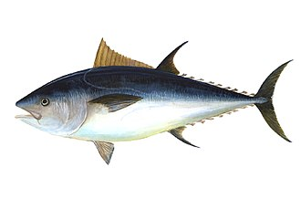

<style>
  .col2 {
    columns: 2 200px;         /* number of columns and width in pixels*/
    -webkit-columns: 2 200px; /* chrome, safari */
    -moz-columns: 2 200px;    /* firefox */
  }
  .col3 {
    columns: 3 100px;
    -webkit-columns: 3 100px;
    -moz-columns: 3 100px;
  }
  .col4 {
    columns: 4 100px;
    -webkit-columns: 4 100px;
    -moz-columns: 4 100px;
  }
</style>

```{r setup, include=FALSE}
library(dplyr)
knitr::opts_chunk$set(echo = FALSE)


```

***

## Documentation 
<div class="col2">

[Trial Specifications Doc (.docx)](TS/TSD.docx)

[Trial Specifications Doc (.pdf)](TS/TSD.pdf)


[CMP Developers Guide (.html)](cMPdevelopment/CMP-Developers-Guide.html)


</div>

***

## Candidate Management Procedure (CMP) Descriptions

[Butterworth Rademeyer BR, SCRS/2022/154](CMP/SCRS_2022_154_Butterworth_Rademeyer.pdf)

[Duprey Hanke FO, SCRS/2022/156](CMP/SCRS_2022_156_Duprey_Hanke.pdf)

[Carruthers TC](CMP/Carruthers.pdf)


***

## Shiny App

<div class="col2">

[Latest version](https://apps.bluematterscience.com/ABTMSE/)

[Legacy (2020) version](https://apps.bluematterscience.com/ABTMSE_2020/)

</div>

***

## Performance Summary Tables

<div class="col2">

[Default primary and secondary tables](https://apps.bluematterscience.com/ABTMSE_Performance/)

[Interactive](https://apps.bluematterscience.com/ABTMSE_Performance2/)

</div>

***

## R package
<div class="col2">

[ABTMSE R Package](https://drive.google.com/drive/folders/1ZR3IudYH8ABcweWO_hWbO1uhImFzFFPm?usp=sharing)

</div>

***

## Operating Model Reports

### Summary Reports

<div class="col2">

[Low length comp fit OM comparison (.html)](Reports/OM_Summary/New_Lcomp_L_summary.html)

[High length comp fit OM comparison (.html)](Reports/OM_Summary/New_Lcomp_H_summary.html)


</div>


### Index Statistic Summary Reports
<div class="col2">

[Low length comp fit index stats (.html)](Reports/OM_Summary/New_Lcomp_L_Index_Fit.html)

[High length comp fit index stats (.html)](Reports/OM_Summary/New_Lcomp_H_Index_Fit.html)


</div>

### Individual OM Diagnostic Reports

<div class="col2">

[Reference Grid OM summary and individual reports (.html)](https://drive.google.com/drive/folders/1sp8yscoGExoLle5GlNs1vG40E6bjb0V2?usp=sharing)

[Robustness Set OM OM summary and individual reports (.html)](https://drive.google.com/drive/folders/192oFZT1SuDL6gA27IHUM4KVLgLyiHnPP?usp=sharing)

</div>

***

## Meeting reports

[September 2020 Second Intersessional Meeting of the ICCAT BFT MSE technical sub-group (ENG)(.pdf)](Reports/Meeting/2020_BFTMSETG_2_ENG.pdf)

[April 2021 First Intersessional Meeting of BFT Species Group (ENG)(.pdf)](Reports/Meeting/2021_BFT1_ENG.pdf)

[September 2021 Second Intersessional Meeting of BFT Species Group (ENG)(.pdf)](Reports/Meeting/2021_BFT2_ENG.pdf)

[November 2021 PA2 meeting  (ENG)(.pdf)](Reports/Meeting/2021_PA2Nov_ENG.pdf)

[March 2022 PA2 meeting including BFT MSE  (ENG)(.pdf)](Reports/Meeting/2022_PA2Mar_ENG.pdf)

[April 2022 BFT Data Preparatory meeting including MSE (ENG)(.pdf)](Reports/Meeting/2022_BFT_DP_ENG.pdf)

[May 2022 First Intersessional Meeting of the ICCAT BFT MSE technical sub-group (ENG)(.pdf)](Reports/Meeting/2022_BFTMSE1_ENG.pdf)

[May 2022 PA2 meeting on BFT MSE  (ENG)(.pdf)](Reports/Meeting/2022_PA2May_ENG.pdf)

[July 2022 E-BFT Stock Assessment meeting including MSE (ENG)(.pdf)](Reports/Meeting/2022_EBFT_SA_ENG.pdf)

[July 2022 PA2 meeting on BFT MSE  (ENG)(.pdf)](Reports/Meeting/2022_PA2Jul_ENG.pdf)

[September 2022 Second Intersessional Meeting of the ICCAT BFT MSE technical sub-group (ENG)(.pdf)](Reports/Meeting/2022_BFTMSE2_ENG.pdf)

***


## Acknowledgements

This work was carried out under the provision of the ICCAT Atlantic Wide Research Programme for Bluefin Tuna (GBYP), funded by the European Union, several ICCAT CPCs, the ICCAT Secretariat and by other entities (see: http://www.iccat.int/GBYP/en/Budget.htm). The contents of these materials do not necessarily reflect the point of view of ICCAT or other funders and in no ways anticipate ICCAT future policy in this area.


&nbsp;
&nbsp;
&nbsp;
&nbsp;
&nbsp;
&nbsp;

